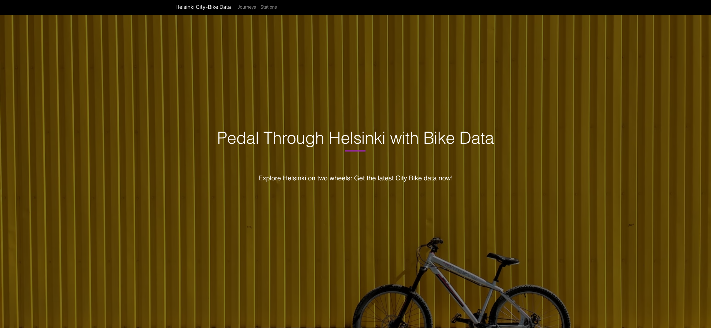
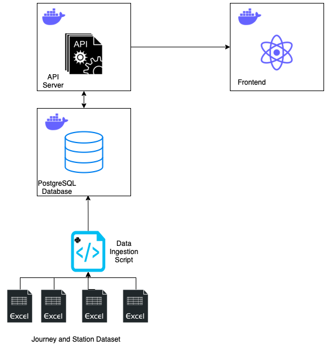

# solita-devacademy-2023-solution

This is a project for Solita Dev Academy Finland 2023. It is a web application for showing City Bike data. It shows journey and station data from the following datasets:

* https://dev.hsl.fi/citybikes/od-trips-2021/2021-05.csv
* https://dev.hsl.fi/citybikes/od-trips-2021/2021-06.csv
* https://dev.hsl.fi/citybikes/od-trips-2021/2021-07.csv
* https://opendata.arcgis.com/datasets/726277c507ef4914b0aec3cbcfcbfafc_0.csv




[](https://github-readme-tech-stack.vercel.app/api/cards?fontSize=15&lineCount=2&theme=github_dark&gap=5&line1=Express,Express.js,2b20fc;Node.js,Node.js,aeddd2;Jest,Jest,db1e1f;Docker,Docker,e425fc;&line2=TypeScript,TypeScript,268fd7;React,React,8373f3;Python,Python,bde24a;PostgreSQL,PostgreSQL,a4cfb6;)

**Backend tech choice rationalization**: I decided to use Node.js with Express and TypeScript to build my API server because it offers several advantages. TypeScript provides a static type system that catches errors during development, making the code more reliable and easier to maintain. Express, on the other hand, is a popular and flexible web framework for Node.js that simplifies the process of building APIs. Combining these two technologies enables me to create a scalable and maintainable API server that's easy to build and test. Additionally, TypeScript's tooling and IDE support make it a developer-friendly choice that saves me time and effort. All in all, using Node.js with Express and TypeScript was a no-brainer for me.

**Frontend tech choice rationalization**: I decided to use React because it's a popular and powerful library for building user interfaces. One of the biggest advantages of React is its component-based architecture, which allows for reusable and modular code. This makes it easier to maintain and scale complex applications. React also provides a virtual DOM, which enables efficient updates to the UI and improves performance. Another benefit is the extensive library of third-party packages available through the npm ecosystem, which makes it easy to add functionality to my application. Finally, React has a vibrant community that's constantly contributing to the development of new tools and best practices. All of these factors combined make React a great choice for building robust and dynamic user interfaces.

**Docker Containerization choice rationalization**:  I chose to containerize my backend and frontend applications because it offers several advantages. Containers provide a lightweight and portable environment that can run consistently across different platforms and infrastructures. This makes it easier to deploy and scale my applications, as I can quickly spin up new instances of my containers on any machine or cloud provider. Additionally, containerizing my applications helps to isolate dependencies and avoid conflicts between different versions of libraries and tools. This makes it easier to manage and maintain my codebase, as well as to collaborate with other developers. Finally, containerization can improve the security of my applications, as I can configure network access and permissions in a more granular way. All of these benefits make containerization a smart choice for building reliable, scalable, and secure applications.

**Data ingestion choice rationalization**: I chose to use Python's Pandas library for data ingestion because it offers a powerful set of tools for cleaning, exploring, and transforming data. Pandas makes it easy to parse and manipulate data from different sources, such as files and databases, and provides a range of functions for data aggregation, filtering, and visualization. Additionally, Pandas integrates well with other Python libraries and frameworks, making it a versatile and flexible choice for data processing. All in all, using Pandas in Python is a smart choice for developers who want to streamline their data ingestion process and gain insights from complex data sets.

**Database choice rationalization**: I chose to use PostgreSQL as my database management system because it's a powerful, open-source, and reliable choice for data management. It offers advanced features for managing complex data structures and provides efficient querying of large datasets. Additionally, PostgreSQL has a vibrant community, is future-proof, and is free to use. All of these factors make PostgreSQL a smart choice for developers who want to build scalable, reliable, and efficient database systems.

## The Architecture 

Here is a diagram for the application:




## Prerequisites
- Docker (https://docs.docker.com/engine/install/) 
- Python3  (https://www.python.org)

## Setup
1. Clone the github repository to your computer.

2. Change directory into /backend/ in the project and run the following command:

```
docker-compose up -d
```

This will run the backend application and database in the background

3. Change the directory into /backend/db-ingestion and install dependencies

```
pip3 install -r requirements.txt
```

4. We're ready to run data ingestion now:

```
python3 importData.py
```

This might take some time so let's wait until the ingestion is done :) 

5. Let's change directory into /frontend/ and create our frontend container:

```
docker-compose up -d
```

This will run the frontend application in the background

The frontend will run in: http://localhost:3000

The backend API documentation can be reached from: http://localhost:8000/docs/#/

***Warning*** 
:warning: The postgresql database have credentials plain in the dockerfile. They should be called from environment variables and should not be used plain in production. This is just for example.


## Tests

There are 2 tests for backend controllers and they can be run by navigating into /backend/ folder and running the following command:

```
npm test
```


## To-Do List

### Data Import

- [x] Import data from the CSV files to local Postgres database
- [x] Validate data before importing
- [x] Don't import journeys that lasted for less than 10 sec.
- [x] Don't import journeys that covered distance shorter than 10 meters

### Journey List View

- [x] List journeys with pagination
- [x] For each journey show: departure and return stations, covered distance in kilometers and duration in minutes
- [x] Ordering per column (extra)
- [ ] Searching (extra)
- [ ] Filtering (extra)

### Station List 

- [x] List all the stations with pagination
- [ ] Searching (extra)

### Single Station View

- [x] Show: station name, station address, total number of journeys starting from the station, total number of journeys ending at the station
- [ ] Station location on map (extra)
- [x] Avg distance starting from and  ending at the station (extra)
- [x] Top 5 most popular stations for journeys starting from and ending at the station (extra)
- [ ] Ability to filter all the calc. per month (extra)

### Extras
- [ ] Dockerize-automate the data ingestion
- [ ] Make the repository unit tests work
- [ ] Implement E2E tests

